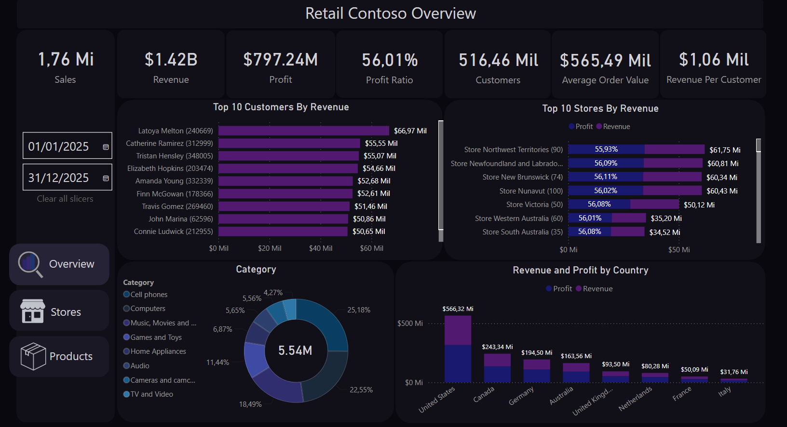
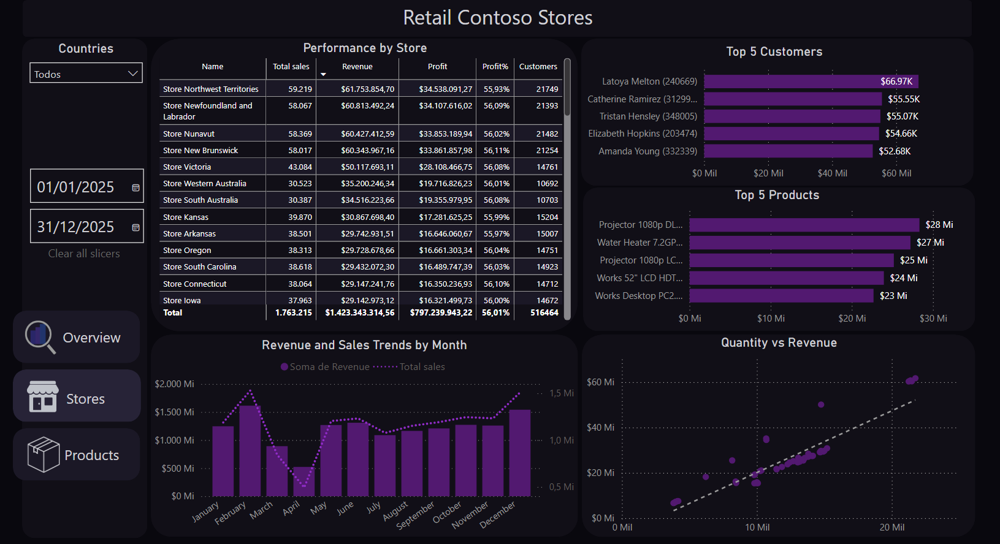
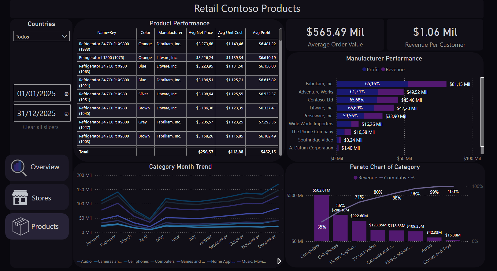

# Retail Contoso Dashboard

**Objetivo do Projeto:** Este projeto tem como objetivo o estudo e a prática de análise de negócios utilizando os dados da rede varejista fictícia 'Contoso' (Microsoft). O escopo do projeto abrange o fluxo de dados completo, com suas informações sendo extraídas de um banco de dados, submetidas a processos de limpeza e padronização estrutural em Python (Pandas) e transformadas em insights no Power BI utilizando a linguagem DAX.

[**Acesse o Dashboard aqui**](https://app.powerbi.com/view?r=eyJrIjoiYzJhNTBmOTgtNTJjYy00NjRlLTg2ODktZmEzMmE0ZGI1MmY4IiwidCI6ImY0MTE4N2VhLTlkNmItNDNlNy04YjNiLWU1NmFmNjQ4N2IwYSJ9&pageName=80e499990def9e32dbea)

[**Link de onde os dados foram baixados**](https://www.microsoft.com/en-us/download/details.aspx?id=18279)

### Visão Geral (Overview)
Esta tela atua como o ponto de entrada do painel Retail Contoso Overview, projetada para entregar um diagnóstico rápido da saúde da empresa. Os KPIs no topo cobrem três dimensões (volume, rentabilidade e eficiência) em um único campo de visão. Os rankings de clientes e lojas e a distribuição geográfica permitem identificar quais frentes estão impulsionando os resultados sem trocar de tela.

  

### Lojas (Stores)
Esta seção foi projetada para permitir uma análise aprofundada do desempenho individual de cada filial. O foco da tela é a interatividade: ao selecionar uma loja específica na tabela principal, o usuário consegue isolar o cenário daquela unidade, cruzando o seu faturamento com a tendência mensal de vendas e o comportamento de clientes e produtos daquela loja.

  

### Produtos (Products)
Esta seção foca no desempenho e na rentabilidade dos produtos. A interface foi feita para rápida identificação dos itens e fabricantes de alta margem, enquanto o Gráfico de Pareto (regra 80/20) direciona decisões estratégicas de estoque ao destacar as categorias que concentram a receita. Complementando com um mapeamento da sazonalidade de vendas ao longo dos meses.

  

 &nbsp; 

## Recursos Interativos

### Navegação entre telas 
  A sidebar permite alternar entre Overview, Stores e Products.

  

### Interatividade  
Clicar em qualquer elemento dos gráficos (cliente, loja, categoria, etc) filtra automaticamente os demais gráficos para o foco da seleção.

  

### Tooltips
Ao passar o cursor em cima de qualquer elemento dos gráficos (cliente, loja, categoria, etc), um tooltip exibe informações detalhadas sobre o item escolhido, permitindo uma leitura individualizada. Certas tabelas das tooltips possuem um tamanho dinâmico para acomodar rótulos de diferentes comprimentos.

  

### Filtros
Todos os elementos visuais do painel respondem a dois filtros globais: país (seleção múltipla) e período (data inicial e final). Na tela Overview, o gráfico de receita por país também funciona como filtro. Ao clicar em um país, o painel filtra os dados de todos os visuais para aquela localização. O botão "Clear all slicers" remove todos os filtros aplicados de uma vez.

  
  
   
  

